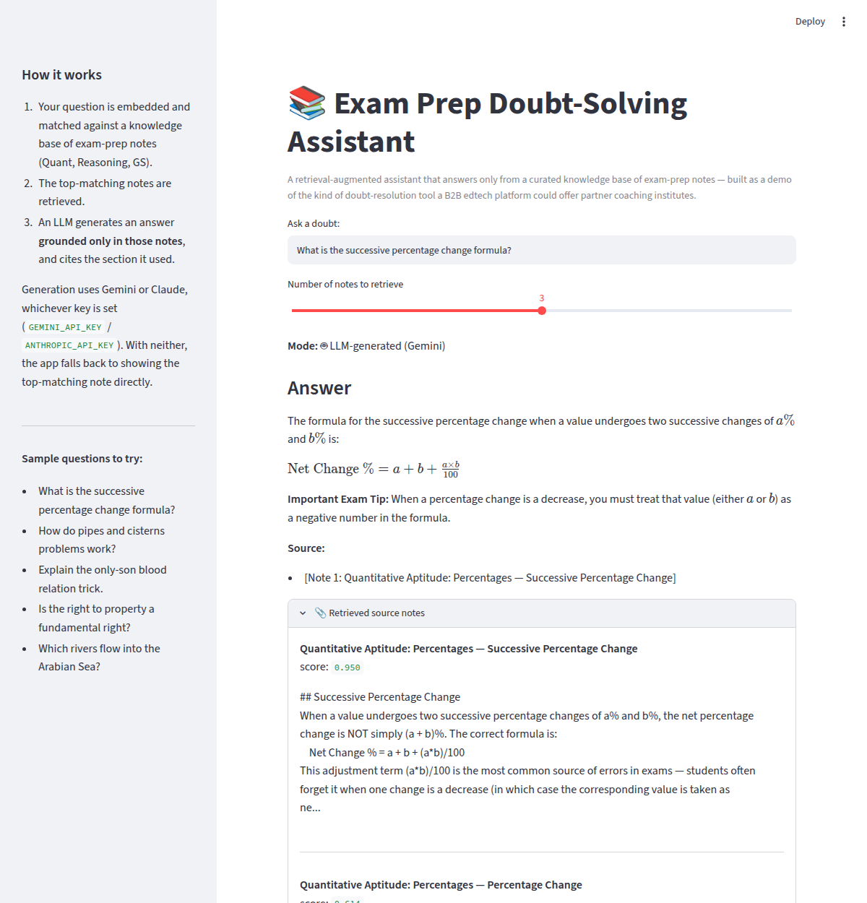

# Exam-Prep Doubt-Solving Assistant (RAG)

A retrieval-augmented generation (RAG) system that answers student doubts on
competitive-exam topics (Quant, Reasoning, General Studies), grounded strictly
in a curated knowledge base — built as a demo of the kind of doubt-resolution
tooling a B2B edtech platform (e.g. one that supplies technology to coaching
institutes) could offer its partner institutes to reduce repetitive-doubt
load on faculty.



*Shown in offline fallback mode (no API key set). The "Retrieved source notes"
panel is the point: every answer can be checked against the exact notes it
came from, and their similarity scores.*

## Why this project
Coaching institutes get flooded with repetitive conceptual doubts. A grounded
RAG assistant can resolve the common ones instantly, cite the exact note it
used (so faculty can verify/trust it), and explicitly say "I don't know" when
the knowledge base doesn't cover a question — instead of hallucinating an
answer, which is the single biggest risk in an exam-prep context.

## Architecture

```
Student question
      │
      ▼
 ┌─────────────┐      ┌──────────────────┐      ┌─────────────────┐
 │  Embed query │ ───▶ │  Retrieve top-k   │ ───▶ │  Generate answer │
 │ (same backend│      │  chunks by cosine │      │  grounded in     │
 │ as ingestion)│      │  similarity       │      │  retrieved text  │
 └─────────────┘      └──────────────────┘      └─────────────────┘
                              ▲                          │
                              │                          ▼
                      data/processed/            Answer + cited
                      (vectors + chunks)          source sections
```

- **Ingestion** (`src/ingest.py`): reads markdown notes from `data/raw/`,
  chunks each doc by its `##` sections (keeping section titles as metadata
  for citation), embeds every chunk, and persists the index.
- **Embeddings** (`src/embeddings.py`): two swappable backends behind one
  interface —
  - `TfidfEmbedder` (default): TF-IDF + truncated SVD, runs fully offline,
    no model download required. This is what `python src/ingest.py` builds
    the index with unless you change the backend.
  - `SentenceTransformerEmbedder`: real dense semantic embeddings via
    `sentence-transformers`, a one-line swap for when you have full
    internet access — recommended upgrade path, since it captures meaning
    rather than keyword overlap.
- **Retrieval** (`src/retrieve.py`): embeds the query with the same fitted
  backend and ranks chunks by cosine similarity.
- **Generation** (`src/generate.py`): builds a prompt that instructs Claude
  to answer *only* from the retrieved notes and to say so if they don't
  cover the question. If no `ANTHROPIC_API_KEY` is set, falls back to
  returning the top-matching note directly (clearly labeled) so the whole
  pipeline stays runnable and demoable without a key.
- **UI** (`app.py`): a Streamlit chat-style front-end with an expandable
  "sources" panel — this is what you'd actually screen-share in an
  interview.

## Measured results (not placeholders)
Retrieval quality was evaluated on 12 hand-labeled questions spanning all 6
knowledge-base docs (`eval/eval_questions.json`), checking whether the
correct source document appears in the top-3 retrieved chunks:

```
Hit rate@3:      12/12 = 100.0%
Top-1 accuracy:  12/12 = 100.0%
```
(Reproduce with `python eval/evaluate_retrieval.py`.)

**Honest caveat**: this is a small, clean, 6-document corpus built to prove
the pipeline works end-to-end — 100% is expected here, not a claim of
state-of-the-art retrieval. The natural next step (and a good thing to
mention if asked in an interview) is scaling the knowledge base to 50-100+
notes with more topic overlap, which is where TF-IDF's keyword-matching
limits would start to show and the `sentence-transformers` backend would
earn its keep.

## Running it

Requires **Python 3.10+** (the `anthropic` 1.x SDK dropped 3.9).

```bash
python -m venv .venv && source .venv/bin/activate   # Windows: .venv\Scripts\activate
pip install -r requirements.txt

# 1. Build the index from data/raw/*.md
python src/ingest.py

# 2. Try it from the CLI
python src/rag_pipeline.py "What is the successive percentage change formula?"

# 3. Check retrieval quality
python eval/evaluate_retrieval.py

# 4. Launch the demo UI
export ANTHROPIC_API_KEY=your_key_here   # optional — omit to run in offline fallback mode
streamlit run app.py
```

`data/processed/` holds generated artifacts (vectors, chunk metadata, and the
pickled fitted embedder) and is gitignored — step 1 regenerates it in about a
second. Rebuild it rather than reusing an index pickled by a different
scikit-learn version, or unpickling warns about version skew.

## Deployment

On Streamlit Community Cloud, point the app at `app.py` and add
`ANTHROPIC_API_KEY` under **Settings → Secrets** (optional — without it the
app runs in offline fallback mode).

Because `data/processed/` is gitignored, a fresh deploy starts with no index.
`app.py` detects that and builds one on first run, so deployment stays a
single step. The alternative — committing the index — would work at this
corpus size but doesn't generalise, and it would mean committing a pickle.

## What I'd build next
- Swap in `sentence-transformers` embeddings once running with full internet
  access, and re-run the eval to quantify the lift over TF-IDF.
- Add a re-ranking step (cross-encoder) for cases where top-k retrieval is
  noisy on a larger corpus.
- Track "couldn't answer" queries as a feed for identifying content gaps in
  the institute's knowledge base — turns the assistant into a content-gap
  analytics tool too, not just a doubt-solver.
- Add per-answer feedback (thumbs up/down) to build a labeled dataset for
  evaluating and eventually fine-tuning retrieval.

## Project structure
```
Hranker/
├── data/
│   ├── raw/            # source knowledge-base notes (markdown)
│   └── processed/       # generated: vectors.npy, chunks.json, embedder.pkl
├── src/
│   ├── embeddings.py    # TF-IDF / sentence-transformers backends
│   ├── ingest.py        # chunking + index building
│   ├── retrieve.py       # similarity search
│   ├── generate.py        # grounded LLM answer generation + offline fallback
│   └── rag_pipeline.py     # ties retrieval + generation together
├── eval/
│   ├── eval_questions.json      # labeled test questions
│   └── evaluate_retrieval.py    # hit-rate@k evaluation
├── app.py                # Streamlit demo UI
├── requirements.txt
└── README.md
```
